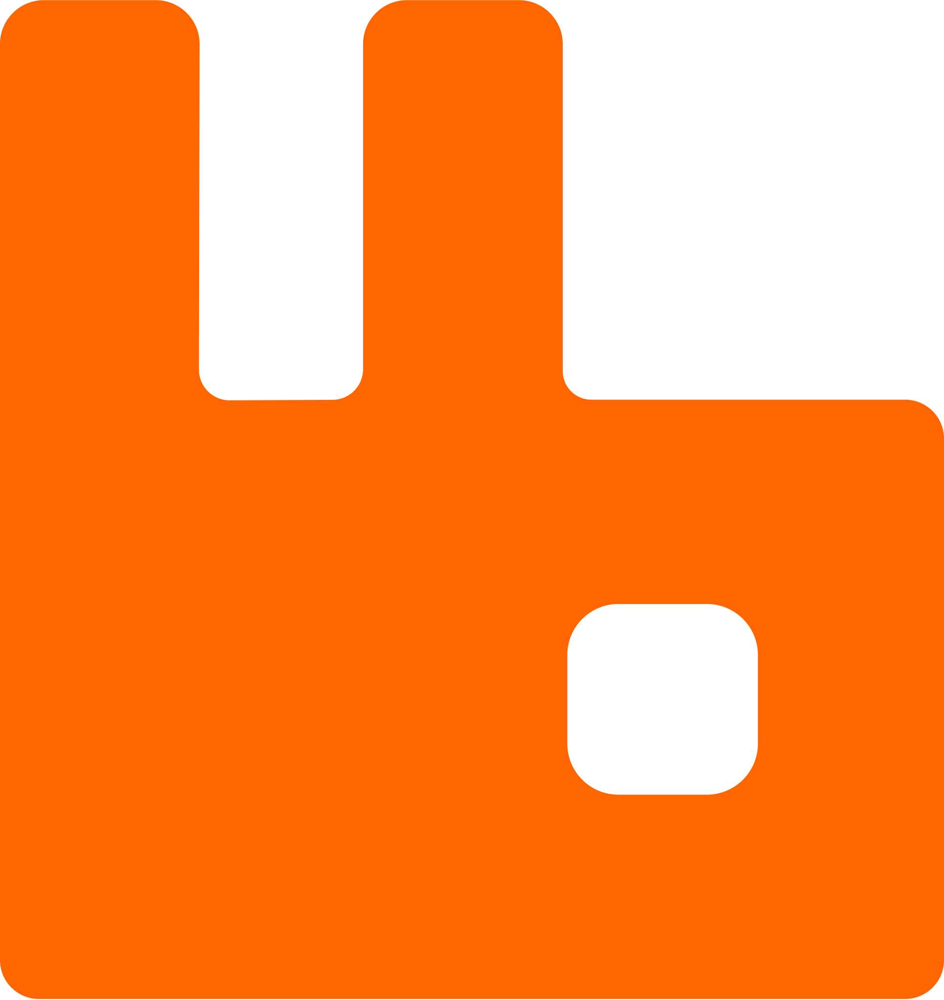

<h1 align="center"> Hi! </h1>

I'm Yaroslav, 22 y.o. Backend Developer from  <b>Russia</b>.

## Languages & Tools

  
  
  
  
  
   
  
  
  
   
  
  
  

## Currently learning

  
   
  
  

## Me

